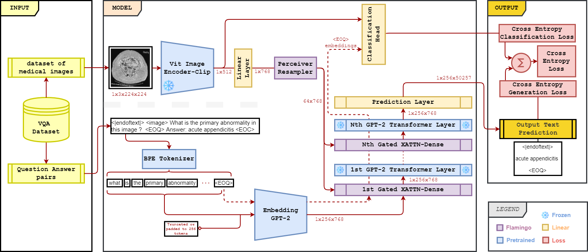

# MLMI VQA model

*Explaining Medical Image Classifiers with Visual Question Answering Models:*<br>
a Visual Question Answering (VQA) Model trained  on medical data


# Description
Deep learning has shown promising potential for Medical Image Classification and Diagnosing.  But added to the limitations of annotated training data in the medical domain, explanations for the models's predictions are also desired in this field of application.

Using [Flamingo, a Visual Language Model for Few-Shot Learning](https://doi.org/10.48550/ARXIV.2204.14198), we leverage big pre-trained language models and vision encoders to build a new VQA model that can answers question for Xray images.

You can find out available pre-trained Models under the [following link](https://drive.google.com/drive/folders/1WYwDez52QNDBsYQPPh5tsSDyV1hs8eJs?usp=sharing)

# Requirements
- [Python](https://www.python.org/downloads/) (Python `>= 3.8`)
- [Conda](https://docs.conda.io/projects/conda/en/latest/user-guide/install/download.html) (Virtual Environment)

# Table Of Contents
-  [Model Architecture](#model-architecture)
-  [Training and Testing](#training-and-testing)
-  [Getting Started](#getting-started)
-  [Demo and Deploy](#demo-and-deploy)
-  [Future Work](#future-work)
-  [Contributing](#contributing)
-  [Acknowledgments](#acknowledgments)


# Model Architecture
Using Flamingo's architecture elements, we built a model capable of taking an Xray image and any question as inputs in order to generate an answer to the asked question. 
<p> A simplified overview of our model architectures is given in the following figures :

### Without Classification Head:


### With Classification Head:


# Training and Testing

## Backbone Flamingo Training MIMIC-CXR

- *Hardware*: 1 A40 GPU, 200 epochs with early stop on val loss (at around 140 each experiment)
- *Learning Rate (LR)*: 1e-4
- *LR Warmup*: 863 Steps
- *Loss*: Cross Entropy Loss 

## Fine-tune on VQA-RAD
Check out [flamingo_clip_gpt2_vqa_rad_run.py](https://gitlab.lrz.de/CAMP_IFL/diva/mlmi-vqa/-/blob/main/notebooks/flamingo_clip_gpt2_vqa_rad_run.py)

- *Hardware*: 1 A40 GPU, 80 epochs with early stop on val loss (at around 40 each experiment)
- *Duration*: ~30 mins
- *LR*: 1e-5
- *LR Warmup*: 30 Steps
- *Loss*: Cross Entropy Loss 

- **Testing**: 
check out [vqaRAD_flamingo_clip_gpt2_infer.ipynb](https://gitlab.lrz.de/CAMP_IFL/diva/mlmi-vqa/-/blob/main/notebooks/playground/vqaRAD_flamingo_clip_gpt2_infer.ipynb): 
    -   On identical answers (GT answer: “no”, predicted answer: “no” -> true positive)
    -   **On embeddings**: Used tokens before the last linear layer for GT and predicted answer &rarr; Cosine Similarity

## Fine-tune on ImageCLEF 
Check out [flamingo_clip_gpt2_imageclef_run.py](https://gitlab.lrz.de/CAMP_IFL/diva/mlmi-vqa/-/blob/main/notebooks/flamingo_clip_gpt2_imageclef_run.py):

- *Hardware*: 1 A40 GPU, 200 epochs with early stop on val loss (at around 110 each experiment)
- *Duration*: ~3 hours
- *LR*: 1e-4
- *LR Warmup*: 30 Steps
- *Loss*: Cross Entropy Loss 

- **Testing**: 
check out [Imageclef_flamingo_clip_gpt2_playground.ipynb](https://gitlab.lrz.de/CAMP_IFL/diva/mlmi-vqa/-/blob/main/notebooks/imageclef_flamingo_clip_gpt2_playground.ipynb):
    - Identical Answer on identical answers (Ground Truth answer: “no”, predicted answer: “no” -> true positive)
    - Classification Accuracy
    - Evaluation: Accuracy, BLEU score


# Getting started

To make it easy for you to get started with our model, here's a list of recommended next steps:

- [ ] Clone this repository into a local folder.
```
cd local/path
git clone https://gitlab.lrz.de/CAMP_IFL/diva/mlmi-vqa
```
- [ ] Setup the python virtual environement using `conda`.

```
conda env create -f environment.yml
conda activate mlmi_caghan
```
- [ ] Check the playground notebooks for usage examples


# Demo and Deploy

You can check and try out our model in our demo page using the QR code
To run the demo check [demo_imageclef.ipynb](https://gitlab.lrz.de/CAMP_IFL/diva/mlmi-vqa/-/blob/main/notebooks/demo_imageclef.ipynb)


***
***

## Future Work
-   Domain Specific Language Decoder
-   Domain Specific Tokenizer
-   Decoder with similar number of parameters to Chinchilla Language Family
-   Optimize current approach
-   Qualitative evaluation and comparison with other works 
-   Visualization of Attention Maps


## Contributing
At the moment we are still closed for contributions.


## Acknowledgments

Authors: **Fabian Scherer - Andrei Mancu - Alaeddine Mellouli - Çağhan Köksal**

We thank the MLMI team and both *Matthias Keicher* and *Kamilia Zaripova* for their help and support.

## License
Private Repository until further development.

